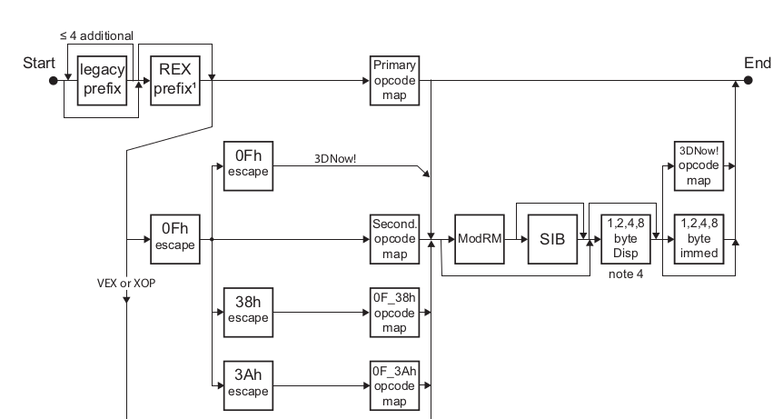
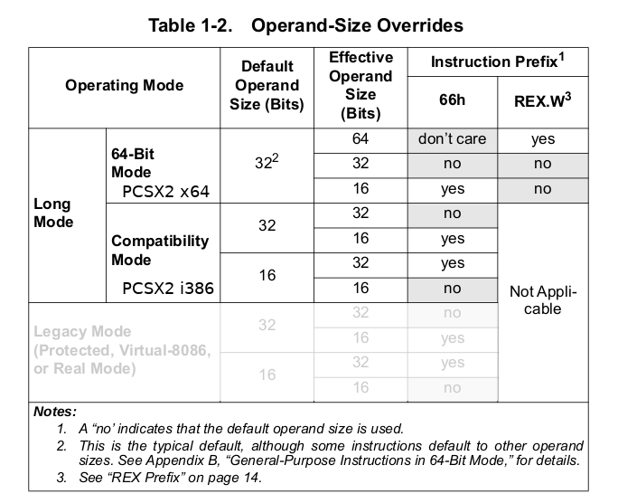

# PS2 JIT compiler port from i386/32bit to x86_64 code

PCSX2 has 6 recompilers:
* R5900-32	: EE RISC processor ("Emotion Engine")
* R3000A 	: I/O processor
* VIF0 Unpack  : Vector Unit Interface 0
* VIF1 Unpack  : Vector Unit Interface 1

Terms/abbreviations:
* GS		Graphics Synthesizer
* SIMD		Single instruction, multiple data
* ABI		Application Binary Interface (e.g. Kernel to application), either 32-bit or 64-bit
* Abbreviations used in x86 or x86_64 op codes:
  * byte        	(8 bit)		suffix b						Integer
  * word        	(2 bytes)   	suffix w						Integer
  * doubleword  	(4 bytes)   	suffix l                                                Integer
  * quadword    	(8 bytes)   	suffix q  e.g. 	movq 	copies 8 bytes			Integer
  * octword	(16 bytes)	suffix o						Integer
  * suffix z: fill leading bits with zero, e.g. copy 1 byte into 2 byte register
  * suffix s: sign extend upper portion e.g. negative byte copied to word fills with ones
  * cwtl	convert word to doublword
  * cltq 	convert doubleword to quadword
  * cqto	convert quodword to octoword
  * Floating point single 		(S)		4 bytes
  * Floating point double		(D)		8 bytes
  * Imm:		‘immediate’ value (a constant) stored in the instruction itself 
		[e.g. ADDI $1,D0]–The $ indicates the constant/immediate 
* ALU		Arithmetic and Logic Unit (performs arithmetic operations like addition and subtraction along with 
logical operations AND, OR, etc.)


Notes: 

* All processors that support the x86_64 instruction set also support the x86/i386/i686 instruction set. If a processor can run 64-bit code, it can also run 32-bit code. Each process, however, must be homogeneous, so either 32-bit or 64-bit.
* When generating code for 64-bit platforms, the order of operations may be different compared to generating 32-bit code.
* x86_64 CPUs 
  * have two modes of operation in Long Mode, a 64-bit mode and compatibility mode. In compatibility mode, the default address size is 32 bits.
  * still make available x87/MMX registers in 64-bit mode 
  * provide full x86 16-bit and 32-bit instruction sets without intervening emulation

Central files:
* pcsx2/pcsx2/R5900.cpp: EE emulation
* common/src/x86emitter/x86emitter.cpp
Questions to resolve:
* Which instructions have to be ported? --> SIB 32bit does not have a corresponding 64-bit equivalent
* Where does the order of operations change?
* Which modules are affected?

Existing instruction sets on i386:

* MMX: a single instruction, multiple data (SIMD) instruction set 
  * 57 instructions
  * 64-bit wide register file (MM0-MM7)
  * only integer operations
  * not able to mix integer-SIMD ops with any floating-point ops
* SSE1: Streaming SIMD Extension 1
  * 128-bit wide register file (XMM0–XMM7) 
* SSE2: Streaming SIMD Extensions 2
* SSSE3: Supplemental Streaming SIMD Extensions 3
* SSE4: Streaming SIMD Extensions 2
* AVX: 											Floating Point
  * Advanced Vector Extensions (since 2011). AVX provides new features, new instructions and a new coding scheme.
  * AVX uses sixteen YMM registers to perform a Single Instruction on Multiple pieces of Data (see SIMD). 
  * The AVX instructions support both 128-bit and 256-bit SIMD
  * Each YMM register can hold and do simultaneous operations (math) on: 
   * eight 32-bit single-precision floating point numbers or 
   * four 64-bit double-precision floating point numbers.
* AVX2 expands most integer commands to 256 bits and introduces fused multiply-accumulate (FMA) operations


Primary opcode maps:			(Escape sequences allow for different maps)
http://sparksandflames.com/files/x86InstructionChart.html


Registers on x86_64:

| 8-byte register | Byte 3-0 | Byte 1-0 | Byte 0 |
| --------------- | -------- | -------- | ------ |
| rax | Eax | ax | al |
| rcx | ecx | cx | cl |
| rdx | edx | dx | dl |
| rbx | ebx | bx | bl |
| rsi | esi | si | sil |
| rdi | edi | di | dil |
| rsp | esp | sp | spl |
| rbp | ebp | bp | bpl |
| r8 | r8d | r8w | r8b |
| r9 | r9d | r9w | r9b |
| r10 | r10d | r10w | r10b |
| r11 | r11d | r11w | r11b |
| r12 | r12d | r12w | r12b |
| r13 | r13d | r13w | r13b |
| r14 | r14d | r14w | r14b |
| r15 | r15d | r15w | r15b |

Instruction encoding on AMD64:




Understanding the tables recLUT and recLutReserve_RAM, the macro PC_GETBLOCK, and the pseudo assembler code in _DynGen_DispatcherReg and _DynGen_JITCompile:

Entries in recLUT are used to jump into 64k elements of recLutReserve_RAM:

```
// 32-bits
d                       = -bfc0 = 0xFFFF4040;
e                       = trunc32(0xFFFF4040 << 14) = trunc32(0x3FFFD0100000) = 0xD0100000;
u                       = recLutReserve_RAM+ 32Mb + 4*0xD0100000;
                        = 0xb35bc000 + 0x2000000 + 4*0xD0100000;
0xb35bc000 + 0x2000000 + 4*0xD0100000 + 0xbfc00000
0xb35bc000 + 0x2000000 + trunc32(340400000) + 0xbfc00000
0xb35bc000 + 0x2000000 + 0x40400000 + 0xbfc00000
trunc32(u + 0xbfc00000) = recLutReserve_RAM+ 32MB;
                        = 0xb35bc000 + 0x2000000;
                        = 0xB55BC000;
// 64-bits
d                       = 0x0 -(bfc0 * sizeof(uptr)/4) = -(bfc0 << 1) = 0xFFFFFFFFFFFE8080;
e                       = trunc64(0xFFFFFFFFFFFE8080 << 13) = 0xffffFFFFD0100000;
u                       = recLutReserve_RAM + 64MB + 8*0xffffFFFFD0100000;
                        = 0x7fff6777f000 + 0x4000000 + 8*0x0xffffFFFFD0100000;
0x7fff6777f000 + 0x4000000 + 8*0xffffFFFFD0100000 + (0xbfc00000 << 1)           = 0x7fff6777f000 + 0x4000000
0x7fff6777f000 + 0x4000000 + trunc64(7FFFFFFFE80800000) + 0x17F800000           = 0x7fff6777f000 + 0x4000000
 
0x7fff6777f000 + 0x4000000 + 0xFFFFFFFE80800000 +         0x17F800000           = 0x7fff6777f000 + 0x4000000
<--------------  recLUT[0xbfc0] -------------->   <-0xbfc00000*sizeof(uptr)/4->  <-recLutReserve_RAM + 64MB->

--> recLUT[0xbfc0] = 0x7fff6777f000 + 0x4000000 + 0xFFFFFFFE80800000 
                   = 0x7FFDEBF7F000
--> recLUT[0xbfc0] + (0xbfc00000 << 1) = recLutReserve_RAM+ 64MB
```
